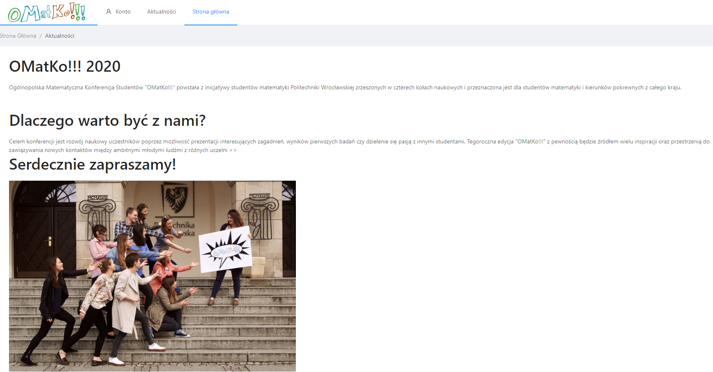
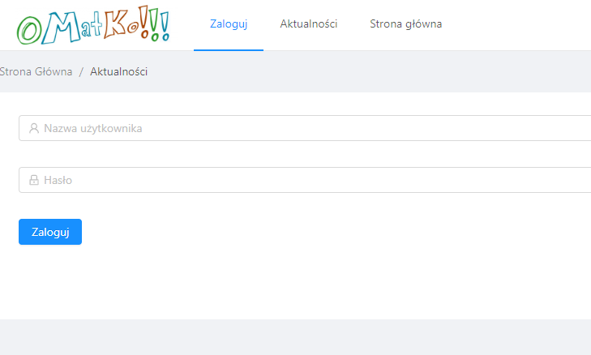
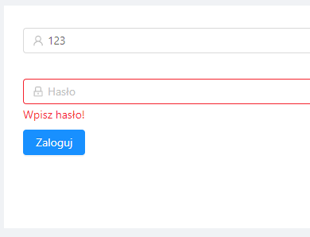
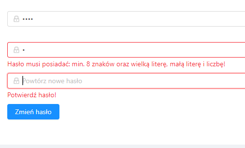
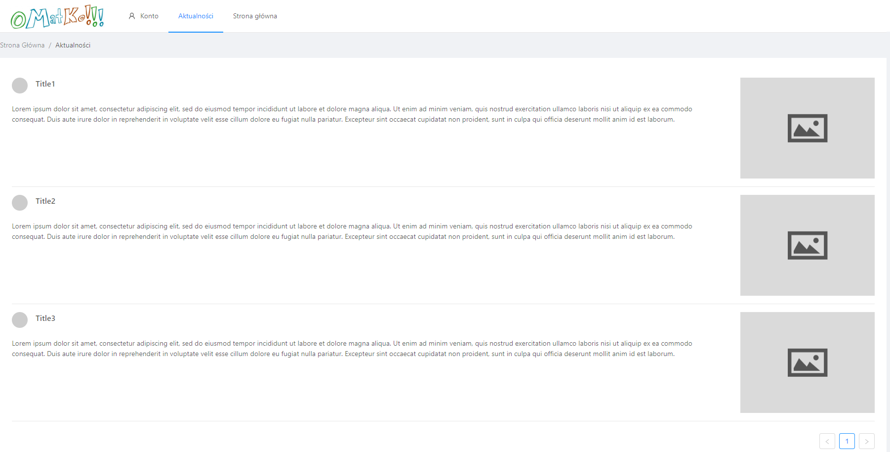
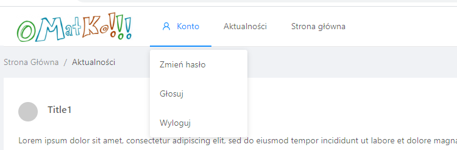
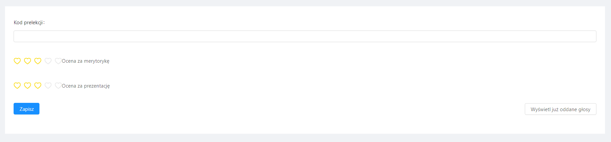
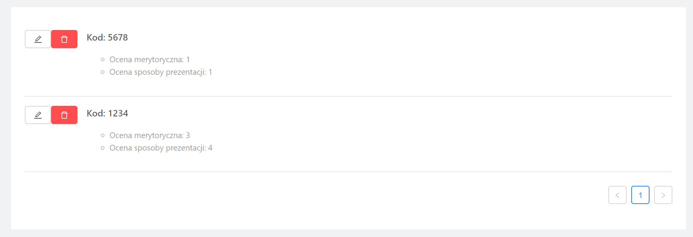
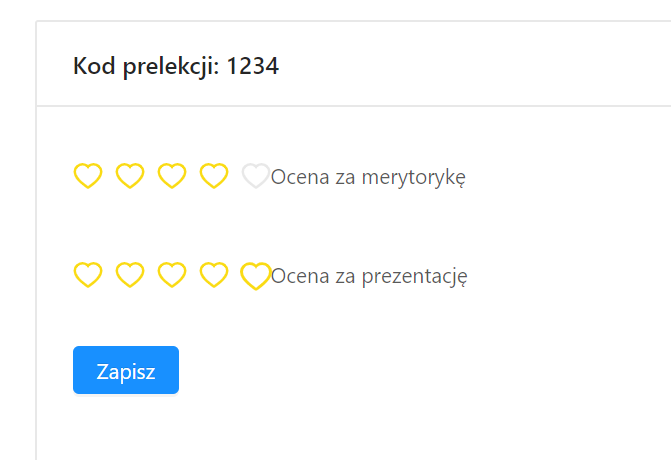

# OMatKo

## Table of contents
* [General info](#general-info)
* [Technologies](#technologies)
* [Setup](#setup)
* [Deployment](#deploy)
* [Documenation](#doc)

## General info
This project is simple web app, which is created on course "Advanced Web Technologies" at the Wroclaw University of Technology.

## Technologies
Project is created with:
* Django
* React
* PostgreSQL

## Setup
Run the following commands to get started:

### Run backend:
1. cd backend
2. pip install -r packages.txt
3. python manage.py runserver

### Run frontend:
1. cd frontend
2. npm i
3. npm start

## Deployment
You can see this app on: https://omatko-app-web.herokuapp.com

## Documentation
Several screenshots showing how the application works:

### Home page
Welcome in our page!

### Log in and log out
If you don't have account or you aren't log in:

Error handling:

* if you don't enter a password:

* if you want change the password, but your new password does not meet the requirements:

### News feed
On the next page you will find news:

### Voting page
When you log in, you can vote for lecture.

Please send your vote to us!

You can check your votes...

...edit or delete them...

### Timetable
Here you can find the event schedule.

